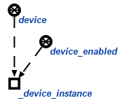

Templates is a very powerful mechanism to work with semantic network (graph). You can search and generate any constructions using templates.
There are list of available classes to work with templates:
* `ScTemplate` - class that represents template in C++ code;
* `ScTemplateGenParams` - parameters that contains values of variables in template. This class usually used when you generate construction by template;
* `ScTemplateSearchResult` - contains result of search by template (list of found constructions);
* `ScTemplateSearchResultItem` - represents on search result item;
* `ScTemplateGenResult` - represent result of generation by template.

## ScTemplate
Class to work with templates in c++. Before reading this paragraph you need to read common [information about types](el_types.md).

Let use `f` symbols for constant parameter of template. Let use `a` symbol for a variable parameter of template. Then template to search all output edges from specified sc-element will be a triple:
* where first element is known `f`;
* second and third elements need to be found `a`.

There are possible 3 types of simple templates:
* `f_a_a` - template to find all outgoing edges from a specified sc-element;
* `f_a_f` - template to find all edges between two specified sc-elements;
* `a_a_f` - template to find all ingoing edges to a specified sc-element.

There are some methods available for `ScTemplate` class:
* `triple` - method that adds triple construction into template. There are some examples of using this function to produce simple templates:

<table>
  <tr>
    <th>Template</th>
    <th>Description</th>
  </tr>

  <tr>
    <td>f_a_a</td>
    <td>
      <strong>Graphical representation</strong>
      <br/></img>
      <br/><strong>Equal C++ code</strong>
      <br/>
<pre><code class="cpp hljs">
ScTemplate templ;
templ.triple(
  param1,
  ScType::EDGE_ACCESS_VAR_POS_PERM,
  ScType::NODE_VAR
);
</code></pre>

      <br/>This triple template using to traverse output edges from specified sc-element.
      <br/>There <code>param1</code> is a known <code>ScAddr</code> of sc-element. It must be a valid (use <code>ScAddr::IsValid</code> method to check). Where <code>_param2</code> and <code>_param3</code> are <code>ScType</code> for compare by search engine. When search engine will traverse output edges from <code>param1</code>. Construction will be added into traverse result, where output edge from <code>param1</code>, will suitable to specified type <code>_param2</code>, and type of target element of this edge will be sutable for a type <code>_param3</code>.
      <br/>You can use any type of <code>_param3</code> (including edges) depending on construction you want to find. But <code>_param2</code> should be any type of variable edge.
    </td>
  </tr>

  <tr>
    <td>f_a_f</td>
    <td><strong>Graphical representation</strong>
    <br/></img>
    <br/><strong>Equal C++ code</strong>
    <br/>
<pre><code class="cpp hljs">
ScTemplate templ;
templ.triple(
  param1,
  ScType::EDGE_ACCESS_VAR_POS_PERM,
  param3
);
</code></pre>
    <br/>This triple template using to find edge between <code>param1</code> and <code>param3</code>.
    <br/>There are <code>param1</code> and <code>param3</code> a known <code>ScAddr</code> of sc-elements. Edge type <code>_param2</code> should be variable.

    </td>
  </tr>

  <tr>
    <td>a_a_f</td>
    <td><strong>Graphical representation</strong>
    <br/></img>
    <br/><strong>Equal C++ code</strong>
    <br/>
<pre><code class="cpp hljs">
ScTemplate templ;
templ.triple(
  ScType::NODE_VAR,
  ScType::EDGE_ACCESS_VAR_POS_PERM,
  param3
);
</code></pre>
    <br/>This triple template using to traverse input edges from specified sc-element.
    <br/>There <code>param3</code> is a known <code>ScAddr</code> of sc-element. You can use any type of <code>_param1</code> (including edges) depending on construction you want to find. But <code>_param2</code> should be any type of variable edge.
    </td>
  </tr>
</table>

When template search engine works, it tries to traverse graph by simple (triple) template in order they specified. For example we need to check if specified sc-element (`_device`) is included into `device` set and `device_enabled` set:



**Code** that generates equal template
```cpp
ScAddr device_addr, device_enabled_addr;
...

ScTemplate templ;
templ.triple(
  device_addr,    // sc-addr of device node
  ScType::EDGE_ACCESS_VAR_POS_PERM,
  ScType::NODE_VAR >> "_device_instance"
);
templ.triple(
  device_enabled_addr,    // sc-addr of device_enabled node
  ScType::EDGE_ACCESS_VAR_POS_PERM,
  "_device_instance"
);
```

In code you can see a construction `ScType::NODE_VAR >> "_device_instance"` - this is a naming for a template element. It allows to set name for a specified sc-element in template, and use it many times in different triples. You can see, that in the second triple we use this name `"_device_instance"`. That means, that we need to place search result from a first triple into the second. So the second triple is a `f_a_f` style triple.

So if you want to use the same element `_x` in different triples, and you doesn't know it `ScAddr`, then just use two main rules:
* set name of this element in a first occurrence of this element in template triples. You need to use `>>` operator to do this (see code below, last element of first triple);
* when you need to use named element in next triples, then just use it name instread of `ScType` or `ScAddr` (see code below, first element if second triple).

**Example code with naming**

```cpp
ScTemplateTempl;
templ.triple(
  any_addr, // sc-addr of known sc-element
  ScType::EDGE_ACCESS_VAR_POS_PERM,  // type of unknown edge
  ScType::NODE_VAR >> "_x"  // type and name for an unknown sc-element
);
templ.triple(
  "_x",  // say that is the same element as the last on in a previous triple
  ScType::EDGE_ACCESS_VAR_POS_PERM,  // type of unknown edge
  ScType::NODE_VAR  // type of unknown sc-element
);
```

## Search
Search algorithm trying to find all possible variants of specified construction.

## Search in construction

## Generate
